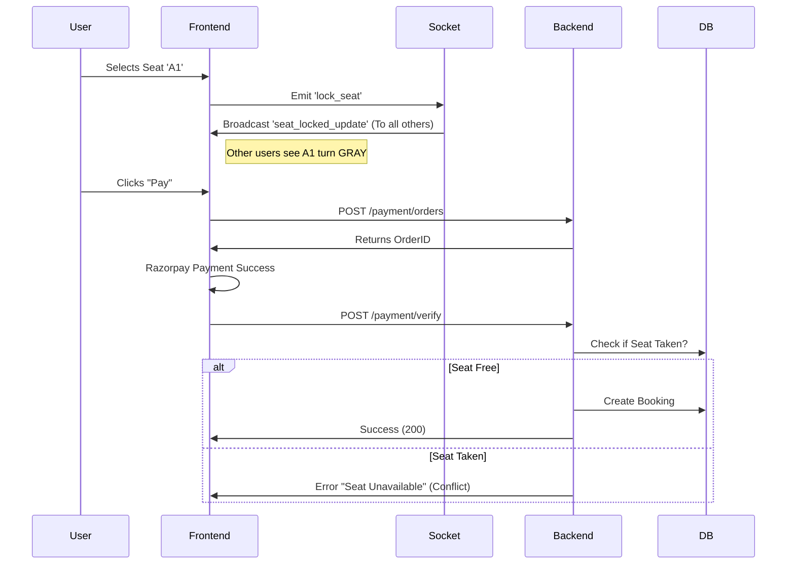

# MovieFlix Deep-Dive Interview Guide

This guide is designed for a **Senior/Mid-Level Engineer** interview. It goes beyond the "what" and explains the **"how"** and **"why"** with code-level details.

## 1. Project Architecture (The "Bird's Eye View")

**Concept:**
A **MERN Stack** application with **Event-Driven Architecture** (Socket.io) for real-time seat selection and **Layered Architecture** (Controller-Service-Model) for backend logic.

**Visual Flow:**
`Client (React)` ⟺ `Load Balancer (Nginx/Dev Server)` ⟺ `API Gateway (Express)` ⟺ `Controllers` ⟺ `Services (Payment/TMDB)` ⟺ `Database (MongoDB)`

### Request Lifecycle Walkthrough (Descriptive Explanation)
"When a user performs an action, such as booking a seat, the request flows through several distinct layers:"
1.  **Client Layer**: React intercepts the user action. If it's a real-time event (like selecting a seat), it emits a **Socket** event. If it's transactional (payment), it makes an **Axios** HTTP request.
2.  **Middleware Layer**: The Express server receives the request. `cors` allows the cross-origin request, `express.json` parses the body, and `authMiddleware` validates the JWT token effectively acting as a **Guard**.
3.  **Controller Layer**: The `bookingController` receives the validated request. It orchestrates the logic but doesn't handle raw data fetching.
4.  **Service/Model Layer**: The controller queries the **MongoDB** database via Mongoose models. This is where business rules (e.g., "Is this seat taken?") are enforced.
5.  **Response**: The server sends a JSON response with a status code (200 for success, 400 for bad requests), which the React frontend interprets to update the UI.

---

## 2. Deep Dive: Authentication & Security

### How it Works (The "Under the Hood"):
1.  **Login:** User sends credentials. Backend verifies using `bcrypt.compare()`.
2.  **Token Generation:** If valid, we sign a **JWT** using `jsonwebtoken`.
    *   **Payload:** `{ id: user._id, isAdmin: user.isAdmin }`
    *   **Secret:** `process.env.JWT_SECRET` (HMAC-SHA256 algorithm)
    *   **Expiry:** 30 days.
3.  **Protection Middleware:** Every protected route uses `authMiddleware.js`.
    *   Extracts token from `Authorization: Bearer <token>` header.
    *   Calls `jwt.verify(token, secret)`.
    *   If valid, fetches user from DB (`User.findById(decoded.id).select('-password')`) and attaches it to `req.user`.

---

## 3. Deep Dive: Real-Time Seat Booking (Concurrency)

### Sequence Diagram: The Booking Flow
This visualization explains exactly what happens when a user books a ticket.



### Backend Validation (The Final Guard):
Even with Sockets, network lag exists. The *DB is the source of truth*. In `bookingController.js`, we validate the seats. Before creating a booking, logic exists querying:
```javascript
const existingBooking = await Booking.findOne({
    showtime: req.body.showtime,
    seats: { $in: req.body.seats },
    status: 'Confirmed'
});
if (existingBooking) throw new Error("Seat already booked");
```

### Concept: Optimistic vs. Pessimistic Locking
*   **What we learned:** "Purely optimistic locking (trusting the frontend) leads to double bookings. Purely pessimistic locking (locking the DB row on read) is slow for a movie app."
*   **Our Solution:** "We use a **Hybrid Approach**. We use **Socket.io** for 'Soft Locks' (visual feedback) to guide user behavior, but we rely on **Atomic DB Reads** (finding existing bookings) as a hard constraint before writing."

---

## 4. Deep Dive: Payment Integration (Razorpay)

### How it Works (Signature Verification):
We trust the **Math**, not the Frontend.

1.  **Order Creation:** Backend generates a generic `order_id` via Razorpay API.
2.  **Verification:**
    *   We verify the signature using **HMAC SHA256**.
    *   `generated_signature = hmac(order_id + "|" + payment_id, secret)`
    *   If `generated_signature !== razorpay_signature`, the request is fraudulent.

### 🚨 Counter Questions:
**Q: What if the internet cuts off after payment but before the backend confirms the booking?**
*   **A:** "This is a classic 'Webhook' use case. Razorpay sends a background webhook to my server (`payment.captured` event). If the frontend fails to notify the backend, the webhook would trigger a function to find the pending booking and mark it as 'Confirmed'."

---

## 5. Master Output: The 10-Minute Presentation Strategy

To fill 10 minutes confidently, you need to move beyond "listing features" and start "teaching the architecture".

**Phase 1: The "Why" & The Hook (2 Minutes)**
*   **Goal:** Establish the problem statement.
*   **Say:** "For my final project, I wanted to build a system that handles **high-concurrency** scenarios, like a movie release day. I built **MovieFlix**, a full-stack reservation platform using the MERN stack."
*   **Detail:** "I chose the **MERN** stack because the **JSON-native** nature of MongoDB fits perfectly with the nested data structure of a Cinema (Cinema -> Screen -> Showtime -> Seats). It allows me to fetch all booking data in a single query without complex joins."
*   **Highlight:** "I didn't just want a CRUD app; I wanted to solve the 'Double Booking' problem where two users click the same seat at the same time."

**Phase 2: Architecture Whiteboarding (3 Minutes)**
*   **Goal:** Show you understand how pieces fit together. (Draw this if you have a whiteboard/screen share).
*   **Action:** Explain the data flow.
    *   "On the **Client**, I use React not just for UI, but to manage **Real-time State**. I integrated **Socket.io-client** to listen for events, keeping the 'Seat Map' live without refreshing the page."
    *   "The **API Layer** acts as a stateless Gateway. It handles Auth (JWT) and delegates complex logic to Controllers."
    *   "I use **Services** for external APIs. For example, `tmdbService.js` is a separate module that handles retries and data mapping from the Movie Database API. This **Separation of Concerns** keeps my code testable and clean."

**Phase 3: The "Star Feature" Code Deep Dive (3 Minutes)**
*   **Goal:** Prove you wrote the code.
*   **Action:** Offer to walk through the **Seat Locking Logic**.
    *   "Let me explain the race-condition handling. When User A clicks a seat, we don't just update the local state. We emit a socket event. The server acts as a **Message Broker** broadcasting this to room `movie_123_showtime_9pm`."
    *   "However, I learned that sockets aren't enough. Network partitions happen. So, in my `bookingController.js`, I added a **Transactional Guard**. Before saving a booking, I perform a query to check if `{ showtime: X, seats: [Y] }` already exists in a *Confirmed* status. This ensures data consistency."

**Phase 4: Scalability & Future (2 Minutes)**
*   **Goal:** Show Senior-level thinking.
*   **Say:** "Currently, this works great for a single multiplex. To scale it to millions of users, I would introduce..."
    *   "**Redis Distributed Locking** to handle concurrency even faster than the DB."
    *   "**Message Queues (RabbitMQ)** for sending email confirmations asynchronously so the user doesn't wait for the SMTP server."

---

## 6. Database Deep Dive & Schema Rationale

### Why MongoDB?
"In a movie app, data is heavily nested. A `Movie` has multiple `Showtimes` and `Seats`. In SQL, I would need complex joins. In MongoDB, I can **Embed** showtimes directly into the Movie document, making 'Read' operations extremely fast."

#### Schema Highlight
We reference `User` and `Movie` in the `Booking` schema to keep it lightweight:
```javascript
{
  user: ObjectId("User_123"), // Reference to keep User profile independent
  movie: ObjectId("Movie_ABC"), // Reference to avoid duplicating Movie data
  seats: ["A1", "A2"], // Array of Strings for simple seat coordinates
  status: "Confirmed" // Enum constraint strictly enforced in Mongoose
}
```

---

## 7. Future Improvements & Scalability (System Design)

When asked: *"How would you scale this to 100,000 users?"*

| Feature | Improvement Strategy |
| :--- | :--- |
| **Database Load** | **Redis Caching**: Movies don't change often. I would cache the "Movie Details" API response in Redis for 1 hour. This would reduce DB hits by 90%. |
| **Concurrency** | **Redis Locks**: Instead of just Sockets, I'd use Redis distributed locks (`SET resource_name my_random_value NX PX 30000`). If User A holds the lock for "Seat A1", User B's request is instantly rejected by Redis before even hitting the DB. |
| **Notifications** | **Message Queue (RabbitMQ)**: Sending emails (Nodemailer) is slow. I would offload this to a separate microservice that consumes messages from a queue, ensuring the Booking API responds instantly. |
| **Traffic** | **Nginx Load Balancer**: Run multiple instances of the Node.js backend and use Nginx to distribute traffic among them using Round Robin. |

---

## 8. Key API Endpoints Summary

| Method | Endpoint | Purpose | Protected? |
| :--- | :--- | :--- | :--- |
| **POST** | `/api/users/login` | Authenticates user & returns JWT | No |
| **POST** | `/api/bookings` | Creates a new booking with seat validation | **Yes** |
| **GET** | `/api/movies/:id` | Fetches movie details & showtimes | No |
| **POST** | `/api/payment/orders` | Generates Razorpay Order ID | **Yes** |
| **POST** | `/api/payment/verify` | Verifies Payment Signature | **Yes** |
| **GET** | `/api/tmdb/import` | (Admin) Imports movies from TMDB | **Yes (Admin)** |

---

## 9. Project Terminology Cheat Sheet
(Use these terms to sound professional during the interview)

*   **Idempotency**: Ensuring that clicking "Pay" twice doesn't charge the user twice. (Handled via Order IDs).
*   **Race Condition**: Two processes competing for the same resource (Seat) at the same time.
*   **Middleware**: Code that runs *between* the request and the response (e.g., Auth check).
*   **Salt Rounds**: The complexity factor for hashing passwords (bcrypt). We use 10 rounds to balance security vs performance.
*   **SPA (Single Page Application)**: React loads once, and subsequent navigations just fetch JSON, not HTML.


